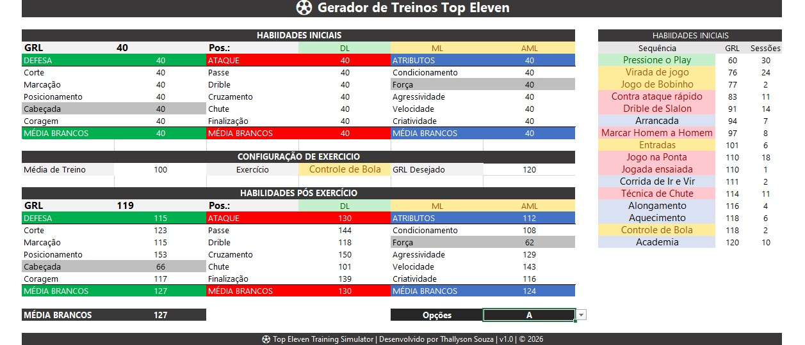
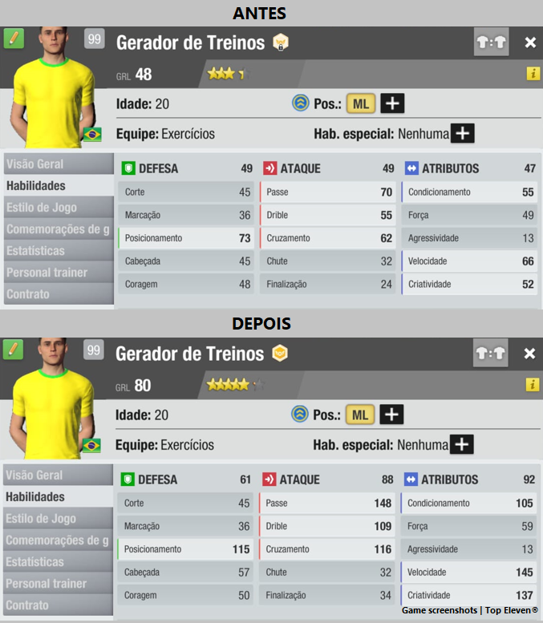
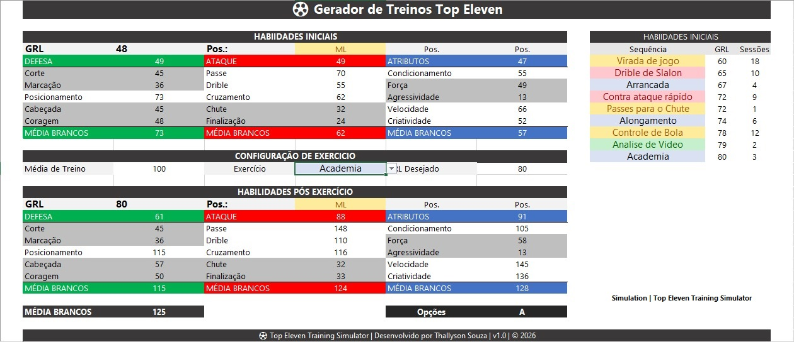
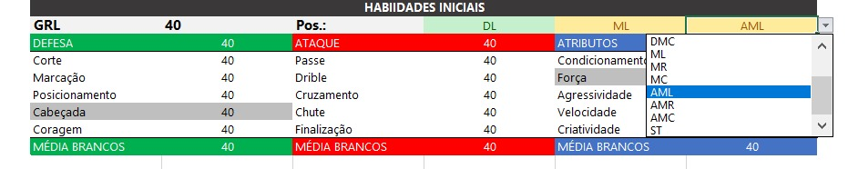
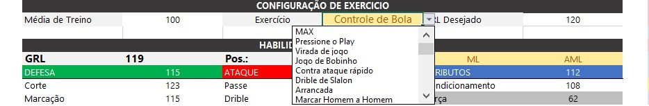
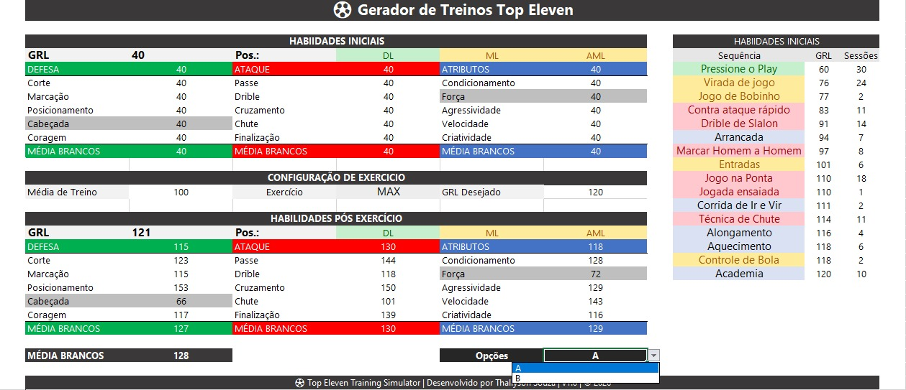
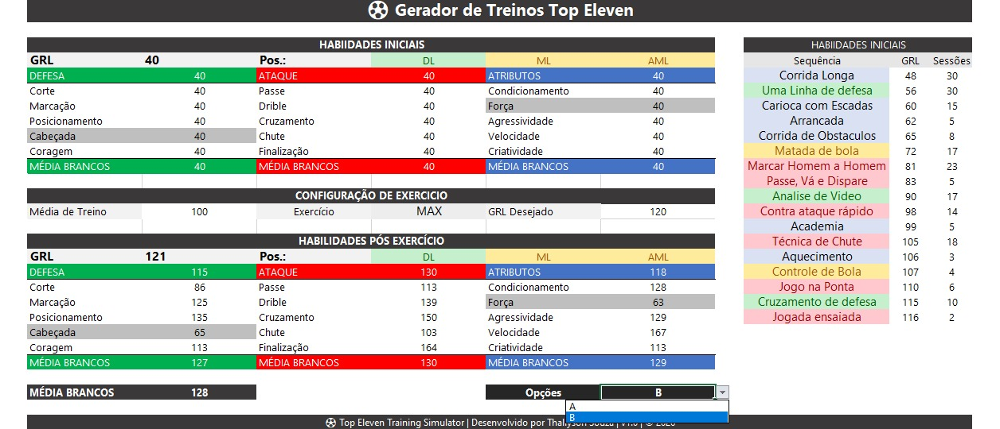
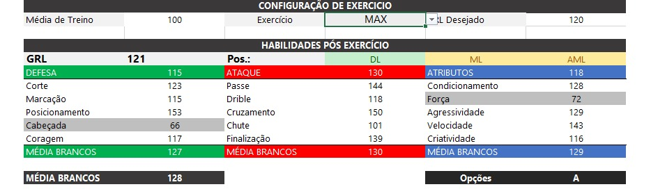
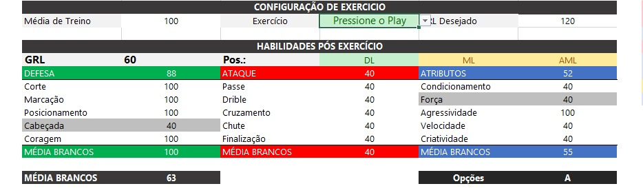

# ⚽ Top Eleven Training Simulator

An advanced Microsoft Excel simulator that automatically generates optimized training sequences for **Top Eleven** players.

Unlike traditional training planners, this simulator focuses on maximizing the player's **White Skills (key attributes)** according to the selected position while minimizing unnecessary growth of secondary (Gray Skills).

Instead of manually testing dozens of training combinations, the simulator calculates the most efficient training sequence, predicts the player's final attributes, and helps players achieve better performance with fewer wasted training sessions.

---

# 🖥️ Main Interface

---

# 🎯 Project Objective

In **Top Eleven**, each player position has a unique set of **White Skills** that contribute the most to on-field performance.

The purpose of this simulator is to automatically generate the most efficient training sequence to maximize those key attributes while reaching the desired Overall Rating (GRL).

The simulator allows users to:

* ⚽ Prioritize White Skills development.
* 📈 Maximize training efficiency.
* 🎯 Reach a target Overall Rating (GRL).
* 💪 Minimize unnecessary Gray Skills growth.
* 🔄 Predict the player's final attributes before performing any in-game training.
* ⚡ Compare multiple optimized training sequences (Option A and Option B).

---

# 💡 How It Works

1. Enter the player's initial attributes.
2. Select the player's position.
3. Define the desired Overall Rating (GRL).
4. Define the desired Training average.
5. The simulator generates one or more optimized training sequences.
6. Review the predicted final attributes before training the player in-game.

This workflow allows players to optimize their training strategy while reducing time spent testing different exercise combinations.

---

# ✨ Features

* ✅ Automatic training generation
* ✅ Position-based optimization
* ✅ White Skills optimization
* ✅ Initial player attribute configuration
* ✅ Target Overall Rating (GRL)
* ✅ Multiple optimized training sequences
* ✅ Exercise-by-exercise visualization
* ✅ Final attribute prediction
* ✅ Automatic White Skills average calculation
* ✅ Input validation
* ✅ Professional Excel dashboard

---

# 📈 Real Validation

The simulator was validated using a real player from **Top Eleven**.

The player was trained by following **exactly** the sequence generated by the simulator.

### Before × After (In-Game)

### Simulator Output

The following simulation generated the exact training sequence used during the validation process.

The player's in-game progression matched the simulator's predicted evolution, validating the generated training sequence.

> **Disclaimer**
>
> The game screenshots displayed above were captured from **Top Eleven** exclusively for demonstration and validation purposes.
>
> **Top Eleven** is a trademark of **Nordeus**.
>
> This project is an independent fan-made tool and is **not affiliated with, endorsed by, or sponsored by Nordeus**.

---

# 👤 Player Configuration

Insert the player's initial attributes and select the player's playing position.

---

# ⚙️ Training Configuration

Configure the desired Overall Rating (GRL), training average and exercise options.

---

# 📋 Generated Training — Option A

Automatically generated optimized training sequence.

---

# 📋 Generated Training — Option B

Alternative optimized training sequence.

---

# 📊 Final Player Attributes

Predicted player attributes after completing the generated training sequence.

---

# 🏋️ Exercise Analysis

Analyze every exercise individually and understand its impact on player development.

---

# 🛠️ Built With

* Microsoft Excel
* Advanced Excel Formulas
* INDEX
* MATCH
* AGGREGATE
* IF
* Data Validation
* Conditional Formatting
* Dynamic Named Ranges

---

# 📦 Download

Download the latest release:

**Top Eleven Training Simulator.rar**

Extract the archive and open the Excel workbook.

---

# 📄 License

This project is licensed under the **Creative Commons Attribution-NonCommercial 4.0 International (CC BY-NC 4.0)**.

You are free to use, study, modify and share this project for **non-commercial purposes**, provided that appropriate credit is given to the original author.

For the full license text, visit:

https://creativecommons.org/licenses/by-nc/4.0/

---

# 👨‍💻 Author

**Thallyson Souza**

Engineering Graduate | Excel Developer | Data Analytics Enthusiast

Developed independently for the **Top Eleven** community.

© 2026 Thallyson Souza. All rights reserved.
